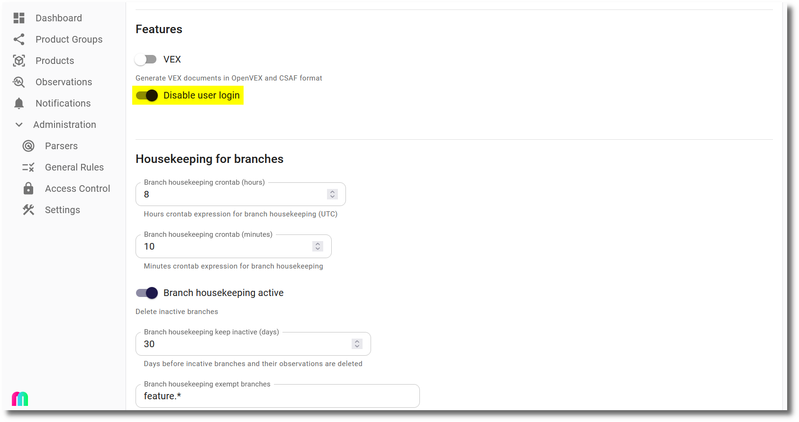
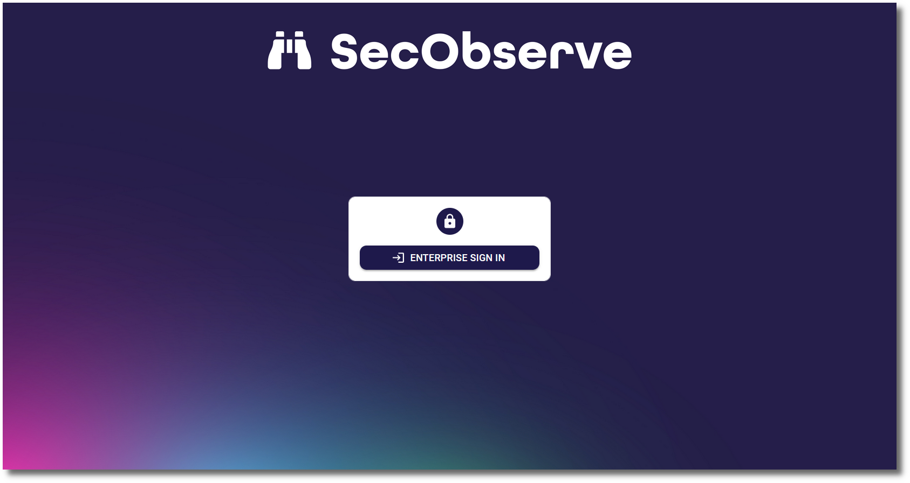
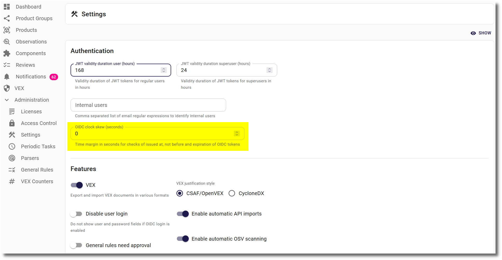

# OpenID Connect authentication

[OpenID Connect](https://openid.net/developers/how-connect-works) authentication has been tested with Keycloak and Microsoft Entra ID. It should work with other OpenID Connect providers as well, as long as they support the [authorization flow](https://oauth.net/2/grant-types/authorization-code) with [PKCE](https://oauth.net/2/pkce) and without a secret.

## Keycloak

In Keycloak a new OpenID Connect client needs to be created. The client needs to be configured as follows, assuming the frontend is available at `https://secobserve.example.com`:

### Configuration parameters for SecObserve

Backend:

| Environment variable | Value                                               |
|----------------------|-----------------------------------------------------|
| `OIDC_AUTHORITY`     | `https://keycloak.example.com/realms/NAME_OF_REALM` |
| `OIDC_CLIENT_ID`     | `CLIENT_ID`                                         |
| `OIDC_USERNAME`      | `preferred_username`                                |
| `OIDC_FIRST_NAME`    | `given_name`                                        |
| `OIDC_LAST_NAME`     | `family_name`                                       |
| `OIDC_EMAIL`         | `email`                                             |
| `OIDC_GROUPS`        | `groups`                                            |

Frontend:

| Environment variable            | Value                                               |
|---------------------------------|-----------------------------------------------------|
| `OIDC_ENABLE`                   | `true`                                              |
| `OIDC_AUTHORITY`                | `https://keycloak.example.com/realms/NAME_OF_REALM` |
| `OIDC_CLIENT_ID`                | `CLIENT_ID`                                         |
| `OIDC_REDIRECT_URI`             | `https://secobserve.example.com`                    |
| `OIDC_POST_LOGOUT_REDIRECT_URI` | `https://secobserve.example.com`                    |
| `OIDC_PROMPT`                   | [no value]                                          |

## Microsoft Entra ID

In Microsoft Entra ID, a new **App registration** needs to be created, with the redirect URI registered under the **Single-page application (SPA)** platform. A client secret is not needed.

### Configuration parameters for SecObserve

Backend:

| Environment variable | Value                                              |
|----------------------|----------------------------------------------------|
| `OIDC_AUTHORITY`     | `https://login.microsoftonline.com/TENANT_ID/v2.0` |
| `OIDC_CLIENT_ID`     | `CLIENT_ID`                                        |
| `OIDC_USERNAME`      | `preferred_username`                               |
| `OIDC_FULL_NAME`     | `name`                                             |
| `OIDC_EMAIL`         | `email`                                            |
| `OIDC_GROUPS`        | `groups`                                           |

Frontend:

| Environment variable            | Value                                              |
|---------------------------------|----------------------------------------------------|
| `OIDC_ENABLE`                   | `true`                                             |
| `OIDC_AUTHORITY`                | `https://login.microsoftonline.com/TENANT_ID/v2.0` |
| `OIDC_CLIENT_ID`                | `CLIENT_ID`                                        |
| `OIDC_REDIRECT_URI`             | `https://secobserve.example.com`                   |
| `OIDC_POST_LOGOUT_REDIRECT_URI` | `https://secobserve.example.com`                   |
| `OIDC_PROMPT`                   | [no value]                                         |

## Customize the login dialog

If users should only be able to sign in with OpenID Connect, the login dialog can be customized to hide user and password fields. This can be done by setting the `Disable user login` option in the `Settings` dialog:

Then the login dialog will only show the `Enterprise sign in` button:

If the user and password is needed to login, e.g. for a local admin user, `#force_user_login` can be added to the URL (like `https://secobserve.example.com/#/login#force_user_login`) to force the user and password fields to be shown.

## Clock skew betwenn OIDC server and SecObserve backend

A time deviation between the OIDC server and the SecObserve backend cannot always be avoided. To prevent the verification of claims issued at, not before and expiry from failing because of it, the parameter `OIDC clock skew`  can be set in the settings.

## Audience validation

By default SecObserve requires the `aud` claim of a token to be a single string that matches the OIDC client id exactly. This is the strictest interpretation and is recommended wherever the OIDC provider supports it.

Not all OIDC providers work that way. Some always issue `aud` as a list, even when it holds a single entry, and some add the ids of other applications to it. With such a provider the login itself succeeds, but every authenticated request fails with HTTP 401 and the backend logs `Invalid claim format in token (strict)`.

For these providers the parameter `OIDC strict audience` can be switched off in the settings. The `aud` claim is then still validated, but a list is accepted as long as it contains the client id, which is the behaviour [RFC 7519, section 4.1.3](https://datatracker.ietf.org/doc/html/rfc7519#section-4.1.3) describes.
