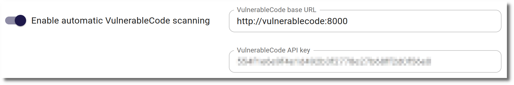
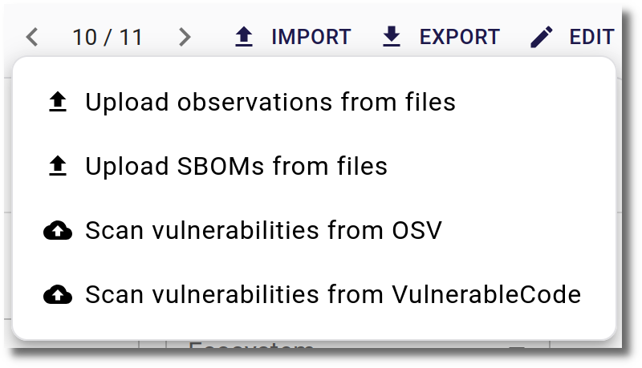
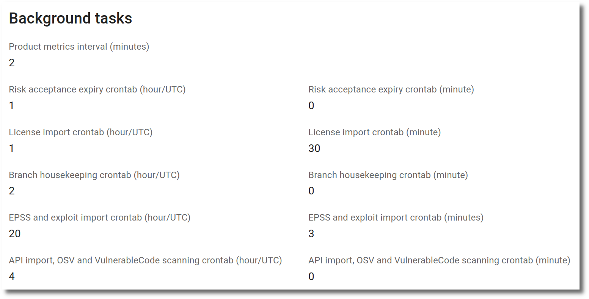
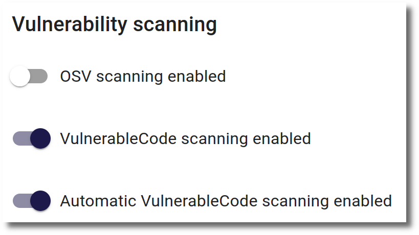

# Vulnerability scanning from VulnerableCode (experimental)

!!! warning
    The integration with VulnerableCode is **experimental**. It is not yet feature complete and the results might not be as accurate as expected.

The components of a product can be scanned for vulnerabilities using [VulnerableCode](https://vulnerablecode.readthedocs.io). VulnerableCode is an open source database, aggregating software vulnerabilities from multiple public advisory sources and presents their details along with their affected packages and fixed-by packages identified by Package URLs (PURLs).

There are 3 preconditions to be met before VulnerableCode can be used for vulnerability scanning:

* The base URL of the VulnerableCode instance has to be configured in the [Settings](#configuration-in-settings).
* License/Component information has to be imported for the product, only then all components are available for scanning. Only components with a PURL (Package URL) can be scanned, components without a PURL are silently skipped.
* The flag `VulnerableCode scanning enabled` in the product settings has to be activated. This flag is activated by default for new products.

## Configuration in Settings

The VulnerableCode parameters are configured in the `Features` section of the [Settings](../getting_started/configuration.md#admininistration-in-secobserve).

{ width="100%" style="display: block; margin: 0 auto" }

- **Enable [automatic VulnerableCode scanning](#automatic-scan)**
- **VulnerableCode base URL:** The URL of the VulnerableCode instance without a trailing path, see [VulnerableCode instances](#vulnerablecode-instances).
- **VulnerableCode API key:** Optional, it is only needed if the VulnerableCode instance requires authentication for its API.

## VulnerableCode instances

Organisations have the choice of either using a publicly available instance of VulnerableCode or set up and use a local installation.

The base URL for the **public instance** is `https://public.vulnerablecode.io`. An API key can be requested with <https://public.vulnerablecode.io/account/request_api_key/>. The public instance has the advantage of working out of the box, but there is no guarantee for its availability and API throttling leading to errors may occur even with an API key.

A **local instance** can be installed with Docker or other ways, see <https://vulnerablecode.readthedocs.io/en/latest/installation.html#installation>. See also <https://vulnerablecode.readthedocs.io/en/latest/api-admin.html> hot to set up an API key. A local instance is more work to set up and maintain, but gives more control about availability and API throttling.

## Manual scan

If all preconditions are met, the VulnerableCode scan can be started manually from the `Import` menu. If a branch is selected, the scan will be performed on the components of the branch. If no branch is selected, the scan will be performed on the components of all branches and components without a branch.

{ width="50%" style="display: block; margin: 0 auto" }

## Automatic scan

VulnerableCode scanning can be configured to run automatically at a specific time. There is a general setting and a setting per product.

#### General setting

In the `Features` section of the [Settings](../getting_started/configuration.md#admininistration-in-secobserve) the automatic VulnerableCode scanning can be enabled or disabled for the whole SecObserve instance.

The hour (in UTC time) and minute, when the automatic [API imports](./api_import.md/#automatic-import), OSV scanning and VulnerableCode scanning will run, can be set in the `Background tasks` section. A restart of the SecObserve instance is required to apply the changes.

{ width="70%" style="display: block; margin: 0 auto" }

#### Setting per product

Only products that have `VulnerableCode scanning enabled` and `Automatic VulnerableCode scanning enabled` turned on will be scanned automatically.

{ width="50%" style="display: block; margin: 0 auto" }

## Funding

&nbsp;&nbsp;&nbsp;&nbsp;&nbsp;&nbsp;&nbsp;&nbsp;&nbsp;&nbsp;[https://nlnet.nl/project/SecObservePlus](https://nlnet.nl/project/SecObservePlus)

Integration of SecObserve with [VulnerableCode](https://vulnerablecode.readthedocs.io) is funded through the [NGI0 Commons Fund](https://nlnet.nl/commonsfund), a fund established by [NLnet](https://nlnet.nl/) with financial support from the European Commission's [Next Generation Internet](https://ngi.eu/) programme, under the aegis of [DG Communications Networks, Content and Technology](https://commission.europa.eu/about-european-commission/departments-and-executive-agencies/communications-networks-content-and-technology_en) under grant agreement No [101135429](https://cordis.europa.eu/project/id/101135429). Additional funding is made available by the [Swiss State Secretariat for Education, Research and Innovation](https://www.sbfi.admin.ch/sbfi/en/home.html) (SERI).
