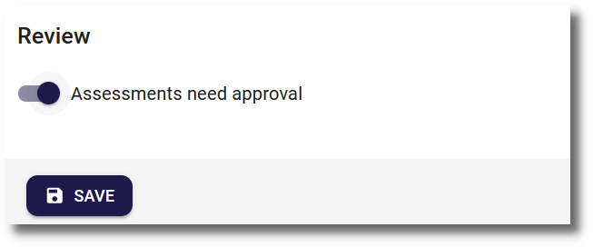
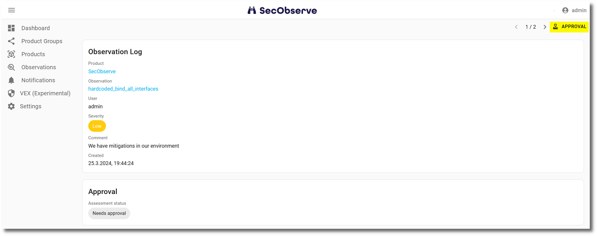
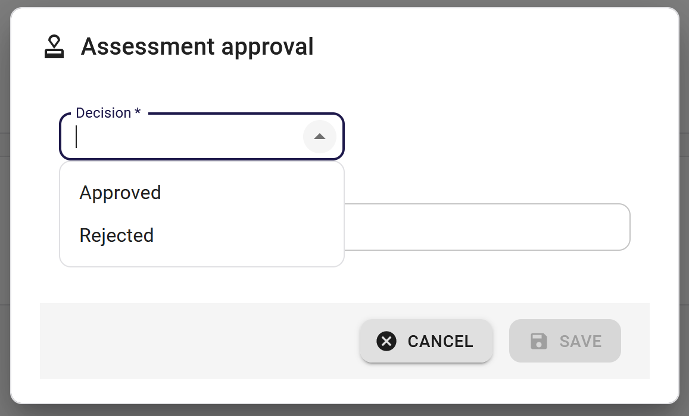
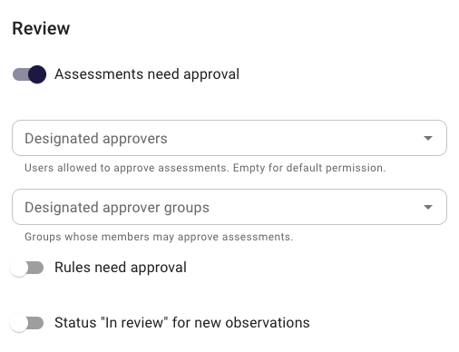
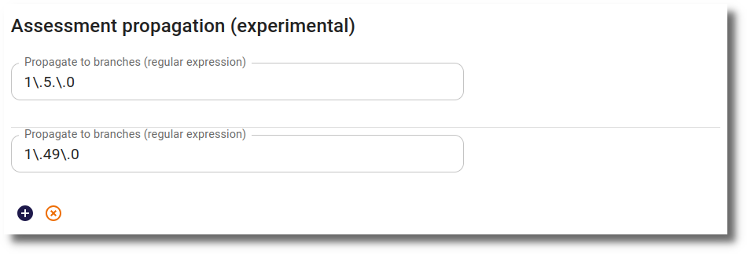
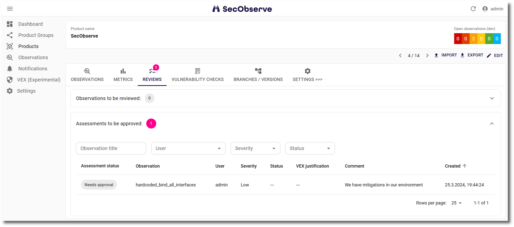

# Assessments, approvals and reviews

## Assessment

With an assessment of an observation the user can change two attributes of an observation:

* The **severity** given by the parser must not necessarily match the severity of the observation for the current product.
* All observations have initially the **status** `Open`. The result of an investigation how to deal with the observation might say,
    * the product is `Affected` by the observation, 

    or the observation must not be fixed because it is ...

    * ... `In review` and needs further investigation.
    * ... already `Resolved`. You have to be aware that the observation will be set back to `Open` if it will be found in a subsequent import.
    * ... a `Duplicate` of another observation.
    * ... a `False positive` that has been detected by the scanner wrongly.
    * ... `Risk accepted`, a decision that a breach because of that observation can be managed.
    * The system is `Not affected` because the observation has been mitigated by a measure.

The dialog to enter the assessment can be opened when showing the observation: 

In the assessment dialog the user can change either the severity and/or the status and has to enter a mandatory comment to explain the change:

{ width="60%" style="display: block; margin: 0 auto" }

A new entry with the changed values is stored in the `Observation Log` after the assessment has been saved.

## Approvals

With the default settings of the product, the assessment is activated right away. If more control is needed, the product can be configured to require an approval before the assessment is activated. This can be done while creating or editing a product:

{ width="60%" style="display: block; margin: 0 auto" }

The setting is also available for product groups. If it is set for a product group, it will be inherited by all products in that group.

If the approval is required, the dialog showing the observation or and the dialog showing the observation log (after clicking on an entry in the list of observation logs) will show a button to either approve or reject the assessment:

Be aware, that the user who has created the assessment is not allowed to approve or reject it. The approval must be done by another user.

{ width="60%" style="display: block; margin: 0 auto" }

### Restricting who may approve

By default, any user with the permission to approve (role `Writer`, `Maintainer` or `Owner`) may approve another user's assessment. In larger organizations the approval often has to be done by a dedicated, independent party, for example a security team. To enforce this, designated approvers can be configured per product. The fields are shown once **Assessments need approval** is enabled:

* **Designated approvers**: individual users that are allowed to approve assessments.
* **Designated approver groups**: authorization groups whose members are allowed to approve assessments.

{ width="60%" style="display: block; margin: 0 auto" }

Only `Maintainer` and `Owner` may configure these fields. Designated approvers must hold a role with the approval permission (`Writer`, `Maintainer` or `Owner`); the picker only offers such members. The same rule applies to designated approver groups: an authorization group must be assigned to the product (or its product group) with at least the `Writer` role. Groups with only the `Reader` role cannot be selected as designated approver groups.

If a user has access through multiple paths, for example directly on the product and through an authorization group, the highest role is used. Product group membership and product group authorization groups are inherited by products in that group.

The behavior is:

* If both fields are left empty, nothing changes: anyone with the approval permission (except the author of the assessment) may approve.
* If at least one approver or approver group is configured, only those designated users - directly or as a member of a configured group - may approve or reject assessments. Users with the `Owner` role may still approve other users' assessments, even if they are not designated. Designated approvers still need a role with the approval permission and no user can approve their own assessment.

Like **Assessments need approval**, the setting can also be configured for a product group and is then inherited by all products in that group; the effective approvers are the combination of the product's and the product group's approvers. The restriction applies to both single and bulk approvals.

## Propagate assessments to other branches (experimental)

Assessments are often very similar for several branches of a product that contains the same finding. These can be propagated from one branch to others, so that a finding is assessed once and then copied to similar findings in other branches of the same product.

Similar finding are observations within one product that have the same title and the same component (name and version).

### Configuration

Product groups and products can configure a list of regular expressions for assessment propagation. New optional field propagate_branches on products and product groups: a list o regular expressions ("Propagate to branches"). 

Propagation is active for an assessment when the branch of the assessed observation matches one of the regular expressions; the assessment is then propagated to similar finding in all other branches matching the same regular expression.

### Propagation of new assessments

When an assessment is saved (and auto-approved) or approved, it is copied to all observations on matching branches for similar findings.

Propagated assessments are marked with the id of the original assessment. They are auto-approved (the original assessment already went through approval if required) and are never propagated again themselves.

### Propagate assessments for new observations

When an import creates a new observation, the newest matching assessment from the other configured branches is applied to it automatically. Only manual assessments count as source: approved, not itself propagated, not created by rules, VEX statements or the parser, and changing severity or status.

## Reviews

To make it easier to find observations with the status `In Review` or assessements needing an approval, a tab is shown for the product, if reviews or approvals are pending:

