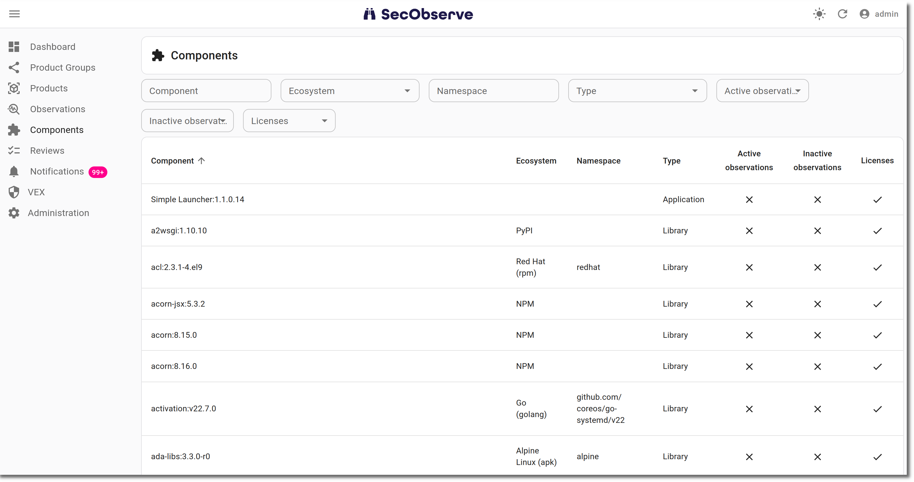

# Components

A `Component` is a library, package or other building block that is used in a product, for example an NPM package, a Maven artifact or a package that is installed in a Docker image.

Components are created automatically, either when [observations are imported](../usage/import_observations.md) or when an [SBOM is uploaded](../usage/upload_sbom.md). They cannot be created, changed or deleted manually.

A component exists only once for the whole SecObserve instance, independent of the products it is used in. That way all vulnerabilities and all licenses of one package version can be seen in one place, no matter in how many products, branches / versions, services or scan reports it occurs.

!!! info
    A `Component` and a `License Component` are two different things. A component is the package itself, e.g. `pkg:npm/lodash@4.17.21`. A license component is the occurrence of a component in one product, together with its license and the evaluation of that license, see [License management](../usage/license_management.md).

## Viewing components

The **Components** entry in the navigation shows the list of all components, from where a user can view a single component with all its observations and licenses.

Users see only components that are used in at least one product they have access to.

## Identification of components

Components are identified by their [Package URL](https://github.com/package-url/purl-spec) (PURL), ignoring upper and lower case. Qualifiers and subpaths of a PURL are not part of the identification, so `pkg:deb/debian/curl@8.5.0?arch=amd64` and `pkg:deb/debian/curl@8.5.0?arch=arm64` are the same component.

If a scan report doesn't provide a PURL for a component, the component is identified by its name and version instead. Components with a PURL and components without a PURL are therefore never merged, even if they have the same name and version.

## Housekeeping

When the last observation and the last license component referencing a component have been deleted, the component itself is deleted as well by the nightly [housekeeping](../usage/branches.md#housekeeping) task.
